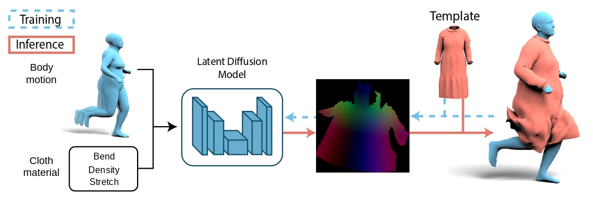

<div align="center">
  <h1>D-Garment: Physics-Conditioned Latent Diffusion for Dynamic Garment Deformations</h1>

  <p style="font-size:1.2em">
    <a href="https://dumoulin.me/"><strong>Antoine Dumoulin</strong></a> ·
    <a href="https://boukhayma.github.io/"><strong>Adnane Boukhayma</strong></a> ·
    <a href="https://www.inrialpes.fr/sed/people/boissieux/"><strong>Laurence Boissieux</strong></a><br>
    <a href="https://sites.google.com/view/bharath-bhushan"><strong>Bharath Bhushan Damodaran</strong></a> ·
    <a href="https://people.irisa.fr/Pierre.Hellier/"><strong>Pierre Hellier</strong></a> ·
    <a href="https://swuhrer.gitlabpages.inria.fr/website/"><strong>Stefanie Wuhrer</strong></a>
  </p>

  <p align="center" style="margin: 2em auto;">
    <a href='https://dumoulina.github.io/d-garment/'></a>
    <a href='https://arxiv.org/abs/2504.03468'></a>
    <a href='https://entrepot.recherche.data.gouv.fr/dataset.xhtml?persistentId=doi:10.57745/GZTNJC'></a>
  </p>

</div>



# Citation

If you find our work useful, please cite:
```
@article{dumoulin2026dgarment,
  title={D-Garment: Physically Grounded Latent Diffusion for Dynamic Garment Deformations},
  author={Dumoulin, Antoine and Boukhayma, Adnane and Boissieux, Laurence and Damodaran, Bharath Bhushan and Hellier, Pierre and Wuhrer, Stefanie},
  journal={Transactions on Machine Learning Research},
  issn={2835-8856},
  year={2026},
  url = {https://openreview.net/forum?id=NrPyio1aUK}
}
```

# License

This code is subject to a non-commerical [license](LICENSE.pdf).

# Installation

## Using Conda environment file

```sh
conda create --name dgarment --file environment.yml
conda activate dgarment
```

## Manual installation

You can use python venv instead of conda if you achieve to install pytorch3d manually.

```sh
conda create --name dgarment python=3.13
conda activate dgarment
pip install torch torchvision torchaudio # --index-url https://download.pytorch.org/whl/cu126 # or whatever version if needed

pip install matplotlib trimesh ipykernel ipywidgets
pip install diffusers[torch]
pip install "transformers[torch]"
pip install "git+https://github.com/nghorbani/human_body_prior.git"


pip install git+https://github.com/hilookas/pyrender@5408c7b45261473511d2399ab625efe11f0b6991#egg=pyrender
pip install accelerate torchgeometry
pip install git+https://github.com/huggingface/diffusers git+https://github.com/huggingface/transformers

conda install pytorch3d -c pytorch3d
pip install "pyglet<2"
pip install wandb

pip install git+https://github.com/jonbarron/robust_loss_pytorch
```

pytorch3d requires specific python/torch/cuda version, if the above fails try to fix the version according to environment.yml or compile it following their `INSTALL.md`  
For reference this should work:
```sh
pip install --upgrade setuptools wheel
conda install iopath -c iopath
CUDA_HOME=.../cuda12.6 CMAKE_BUILD_PARALLEL_LEVEL=2 pip install "git+https://github.com/facebookresearch/pytorch3d.git"
```

# Setup

Download SMPLH from https://mano.is.tue.mpg.de/ to `src/body_models` or set ["smpl_info"] in `config.json`.

Download dataset from https://entrepot.recherche.data.gouv.fr/dataset.xhtml?persistentId=doi:10.57745/GZTNJC 

D-Garment model weights are in `models` folder.

Changes in `config.json`:
  - ["dataset"]/["folder"]: ".../DATASET_PATH" to the dataset root folder
  - same for ["template_path"] and ["subdivided_template_path"]
  - ["output"]/["folder"]: "../output/D-garment" to the model weights location (or place them in this folder)

# Reproducibility

To run the next command lines, set the root folder of the dataset and experiment folder:
```sh
cd src
EXP_DATA=.../EXPERIMENT_PATH
DATASET=.../DATASET_PATH
```

## Generate Dataset

First install the simulator and follow instruction here:
https://gitlab.inria.fr/elan-public-code/projectivefriction

Download the dataset to get the body motion set and delete the simulated clothes if wanted from:
https://entrepot.recherche.data.gouv.fr/dataset.xhtml?persistentId=doi:10.57745/GZTNJC  
You can also get them from:
https://amass.is.tue.mpg.de/

In `config.json` adapt ["dataset"] paths accordingly.

Paper reproduction:
```sh
py AMASS_prep.py ../configs/config.json        # preprocess AMASS
py run_simulation.py ../configs/config.json    # simulate cloth over AMASS
py fix_intersections.py ../configs/config.json # fix cloth penetrating body
```

Recommended method if you want to generate your own dataset (uncomment line 101):
```sh
py run_simulation.py ../configs/config.json --system_tmp /tmp --max_workers 40
```

To prepare the template for the model using Optcuts, output will be in Optcuts output folder:
```sh
py mean_shape.py ../configs/config.json        # compute the mean cloth positions over the dataset
.../OptCuts_bin 100 meshFolderPath MeshName 0.025 0 2 4.1 1 0
```

## Train

The VAE decoder can be finetuned using `vae_finetune.ipynb`

To train the U-net diffusion model run:
```sh
py training.py ../configs/config.json
```

## Generate evaluation and ablations

```sh
py generate_evaluation.py ../configs/config.json ${EXP_DATA}/dgarment/
py generate_evaluation.py ../configs/ablation_material.json ${EXP_DATA}/ABLATION/ablation_material/
py generate_evaluation.py ../configs/ablation_motion.json ${EXP_DATA}/ABLATION/ablation_motion/
py generate_evaluation.py ../configs/config.json ${EXP_DATA}/ABLATION/dgarment_subdivision/ --subdivide
py generate_evaluation.py ../configs/ablation_5_poses.json ${EXP_DATA}/ABLATION/ablation_5_poses/
```

### Make the predictions

First copy the vae model to the ablations folders:
```sh
cp -r models/D-garment/vae models/ablation_motion/vae
cp -r models/D-garment/vae models/ablation_material/vae
```

Then to run the model and the ablations:
```sh
py metrics.py ../configs/config.json ${EXP_DATA}/dgarment/ ${DATASET}/Cos5kZero.obj &
py metrics.py ../configs/config.json ${EXP_DATA}/ABLATION/ablation_motion/ ${DATASET}/Cos5kZero.obj --post_process &
py metrics.py ../configs/config.json ${EXP_DATA}/ABLATION/ablation_material/ ${DATASET}/Cos5kZero.obj --post_process &
py metrics.py ../configs/config.json ${EXP_DATA}/ABLATION/dgarment_subdivision/ ${DATASET}/Cos5kZero_subdivided.obj --post_process &
py metrics.py ../configs/ablation_5_poses.json ${EXP_DATA}/ABLATION/ablation_5_poses/ ${DATASET}/Cos5kZero.obj --post_process 
```

To generate the table in latex:
```sh
py latex_table.py ${EXP_DATA}/ABLATION
```

To extract meshes used in the paper (hard coded filter line 214):
```sh
py mesh_extraction.py ../configs/config.json ${EXP_DATA}/dgarment/ ${DATASET}/Cos5kZero.obj --post_process
```

Figure 6 includes frames 8 and 52 of `B16-walkturnchangedirection/shape0/simulation_1`

Video sequences:
- `B16-walkturnchangedirection/shape0/simulation_1`
- `B17-walktohoptowalk1/shape1/simulation_1`
- `C19-runtohoptowalk/shape1/simulation_1`

### Diffusion steps

We only present results with 20 steps in the paper, you can easily compare and analyse the effect of the number of diffusion step with the `--step` argument here:
```sh
py generate_evaluation.py ../configs/config.json ${EXP_DATA}/DIFFUSION_STEPS/dgarment_5steps/ --step 5
py generate_evaluation.py ../configs/config.json ${EXP_DATA}/DIFFUSION_STEPS/dgarment_8steps/ --step 8
py generate_evaluation.py ../configs/config.json ${EXP_DATA}/DIFFUSION_STEPS/dgarment_10steps/ --step 10
py generate_evaluation.py ../configs/config.json ${EXP_DATA}/DIFFUSION_STEPS/dgarment_15steps/ --step 15
py generate_evaluation.py ../configs/config.json ${EXP_DATA}/DIFFUSION_STEPS/dgarment_50steps/ --step 50

py metrics.py ../configs/config.json ${EXP_DATA}/DIFFUSION_STEPS/dgarment_5steps/ ${DATASET}/Cos5kZero.obj --post_process &
py metrics.py ../configs/config.json ${EXP_DATA}/DIFFUSION_STEPS/dgarment_8steps/ ${DATASET}/Cos5kZero.obj --post_process &
py metrics.py ../configs/config.json ${EXP_DATA}/DIFFUSION_STEPS/dgarment_10steps/ ${DATASET}/Cos5kZero.obj --post_process &
py metrics.py ../configs/config.json ${EXP_DATA}/DIFFUSION_STEPS/dgarment_15steps/ ${DATASET}/Cos5kZero.obj --post_process &
py metrics.py ../configs/config.json ${EXP_DATA}/DIFFUSION_STEPS/dgarment_50steps/ ${DATASET}/Cos5kZero.obj --post_process
```

## 4D-HumanOutfit reconstruction

This experiment requires to obtain 4DHumanOutfit license and models here: 
https://kinovis.inria.fr/4dhumanoutfit/

The 3D reconstructions can be obtain following https://gitlab.inria.fr/projects-morpheo/ProbeSDF

```sh
py register_kinovis.py ../configs/config.json .../fit_sue-cos-walk/capture/ --output .../fit_sue-cos-walk/last_result --seed 356 --subdivide --unique_latent --filter_capture --concat_body
py register_kinovis.py ../configs/config.json .../fit_sue-cos-run/capture/ --output .../fit_sue-cos-run/last_result --seed 260 --subdivide --unique_latent --filter_capture --concat_body
```

### Fitting with material optimization

```sh
py register_kinovis.py ../configs/config.json .../fit_sue-cos-walk/capture/ --output .../fit_sue-cos-walk/opti_mat --seed 356 --subdivide --unique_latent --filter_capture --optimize_material --batch_size 6 --concat_body
py register_kinovis.py ../configs/config.json .../fit_sue-cos-run/capture/ --output .../fit_sue-cos-run/opti_mat --seed 260 --subdivide --unique_latent --filter_capture --optimize_material --batch_size 6 --concat_body
```

Generate Figure 8 (switch comment between line 18 and 22):
```sh
py plot_registration.py
```
